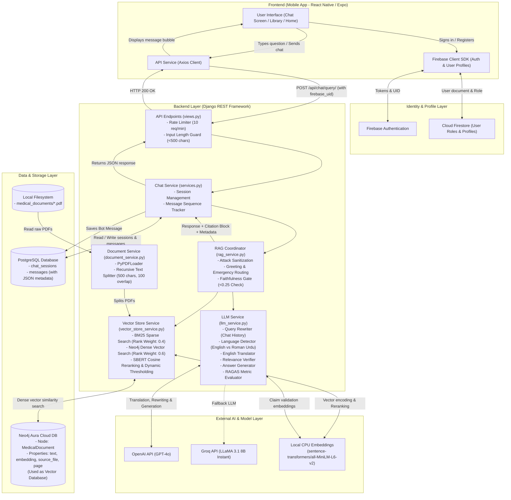
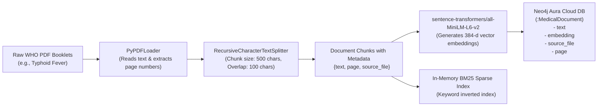
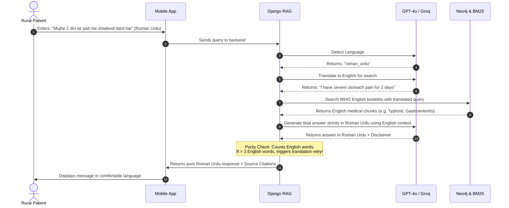

# FYP-SEHAT: System Architecture & Technical Audit

## 1. One-Paragraph Summary

**FYP-SEHAT** is a mobile health assistance application built to provide reliable medical guidance for rural communities in Pakistan. A user types a health question or symptom into a React Native mobile application in either English or Roman Urdu (Urdu words written with English letters). The request travels to a Python Django backend, which converts the query into English, searches through indexed World Health Organization (WHO) medical booklets using a hybrid search engine (combining keyword search and AI vector similarity hosted on Neo4j Aura), and feeds the retrieved facts to a Large Language Model (OpenAI GPT-4o or Groq LLaMA 3.1) to generate an easy-to-understand answer. The final response includes source citations showing the exact booklet name and page numbers, enforces medical disclaimers, evaluates answer quality with a mathematical safety gate, and stores the chat history in a PostgreSQL database linked to the user's Firebase account.

---

## 2. Big-Picture Architecture Diagram

The flowchart below illustrates how every layer of the system connects together—from the mobile user's screen down to the AI services and databases.



---

## 3. Step-by-Step: What Happens When a User Asks a Health Question

This section traces the full life cycle of a single medical question, from the tap of a button on a smartphone to the final answer displayed on the screen.

### Step 1: User Asks a Question in the Mobile App
* The user opens the **Chatbot** tab in the React Native mobile app (`chatbot.jsx`).
* The user types their question into the bottom text input field (or taps one of the predefined quick prompts such as *"I have fever and headache"*).
* The app validates that the message is not blank and does not exceed 500 characters.
* A user message bubble appears immediately in the UI.

### Step 2: Request Sent to the Backend
* The app grabs the active `sessionId` (or leaves it blank if this is the very first message).
* It extracts the user's Firebase user ID (`firebase_uid`) from the local auth session.
* It slices the last 6 messages from the conversation to provide memory context.
* It sends an HTTP `POST` request to `http://<server-ip>:8000/api/chat/query/` with this JSON body:
  ```json
  {
    "session_id": "3fa85f64-5717-4562-b3fc-2c963f66afa6",
    "query": "Mujhe 3 din se tez bukhar hai aur ulti ho rahi hai",
    "firebase_uid": "usr_abc123xyz",
    "chat_history": [
      {"sender": "user", "text": "..."},
      {"sender": "bot", "text": "..."}
    ]
  }
  ```

### Step 3: Security, Rate Limiting, and Session Verification
* **Rate Limiting:** An in-memory cache checks how many requests this `firebase_uid` has made in the past 60 seconds. If it exceeds 10 requests, the backend immediately returns an HTTP `429 Too Many Requests` error.
* **Length Check:** The backend rejects queries exceeding 500 characters.
* **Session Ownership:** The backend looks up the `session_id` in PostgreSQL. If the session exists but belongs to a different `firebase_uid`, it returns a 404 error to prevent unauthorized access.
* **Database Record:** The user's query is saved into the PostgreSQL `messages` table with an auto-incremented sequence number.

### Step 4: Prompt Sanitization & Emergency Routing
* The query is scanned against regex patterns for prompt injection attempts (e.g., *"ignore previous instructions"*, *"DAN"*, *"jailbreak"*). If matched, the query is rejected.
* The query is scanned against self-harm and suicide regex patterns (e.g., *"want to die"*, *"suicide"*).
* **Emergency Intercept:** If self-harm is detected, the system immediately bypasses retrieval and returns an emergency response in the user's language directing them to Pakistan's **1122 emergency helpline**.

### Step 5: Query Classification, Rewriting, and Language Detection
* **Greeting Check:** Fast regex patterns check for *"hi"*, *"salam"*, *"assalam-o-alaikum"*, etc. If it is purely a greeting, the LLM generates a friendly 2-sentence greeting without doing any document search.
* **Query Rewriting:** If past conversation exists, the LLM rewrites follow-up questions into standalone queries. For example, if the previous turn was about *typhoid*, and the user asks *"Iska ilaaj kya hai?"* ("What is its cure?"), the LLM rewrites it to *"Typhoid ka ilaaj kya hai?"*.
* **Language Detection:**
  * Checks for Devanagari script characters. If found, it halts and returns an error explaining that Hindi script is not supported.
  * An LLM classifies the query as either `english` or `roman_urdu`.
* **Translation to English:** If the query is in Roman Urdu, the LLM translates it into clear English text (e.g., *"I have high fever for 3 days and vomiting"*). This English version is required because the medical reference documents are written in English.

### Step 6: Hybrid Document Retrieval (BM25 + Neo4j Vector)
The English query is sent to `VectorStoreService.hybrid_search()`:
1. **Sparse Search (BM25):** Performs keyword matching against loaded document chunks. Up to 10 matching chunks are retrieved.
2. **Dense Vector Search (Neo4j):** Generates a 384-dimensional vector embedding of the query using the local `sentence-transformers/all-MiniLM-L6-v2` model. It searches the Neo4j Aura database for the top 10 closest document chunks using cosine distance on the vector index `medical_docs`.
3. **Reciprocal Rank Fusion (RRF):** Combines the ranks from both searches into a unified score:
   $$\text{Score} = \frac{0.4}{\text{rank}_{\text{BM25}} + 60} + \frac{0.6}{\text{rank}_{\text{Neo4j}} + 60}$$
4. **SBERT Re-ranking:** Takes the unified unique candidate chunks and computes exact cosine similarity between the query embedding and each chunk embedding using local SBERT.
5. **Dynamic Cutoff:**
   * If the top score is $> 0.5$, chunks below $0.35$ are discarded.
   * If the top score is $> 0.3$, chunks below $0.25$ are discarded.
   * Otherwise, chunks below $0.20$ are discarded.
   * Up to the top 5 surviving chunks are selected. If no chunk meets the threshold, the search returns empty.

### Step 7: Relevance Verification
* Before calling the generator, the system passes the retrieved text and user question to the LLM for a binary check: *"Does this retrieved medical text actually answer this question? (YES or NO)"*.
* If the LLM responds NO, the system avoids generating false information and immediately responds with a safe fallback:
  * English: *"Sorry, I could not find information about this in my knowledge base. Please consult a doctor."*
  * Roman Urdu: *"Maafi chahta hoon, is sawaal ka jawab mere paas mojood documents mein nahi mila. Kisi doctor se rabta karein."*

### Step 8: LLM Answer Generation & Medical Safety Constraints
* The retrieved text, chat history, and user question are injected into a strict prompt.
* **Strict Rules Given to the Model:**
  1. Rely **only** on the provided medical text—never invent facts.
  2. Answer strictly in the requested language (pure English or pure Roman Urdu). Never mix the two.
  3. Maximum 5 unique bullet points using dashes.
  4. Never give recipes, code, or non-medical advice.
  5. Always include the medical disclaimer: *"This is not a substitute for professional medical advice."*
* The request is sent to **OpenAI GPT-4o** (or fallback **Groq LLaMA 3.1 8B**).

### Step 9: Language Purity & Faithfulness Verification
* **Roman Urdu Purity Check:** If the response was meant to be Roman Urdu, the code scans it for English words (e.g., *"the"*, *"infection"*, *"hospital"*, *"treatment"*). If more than 3 English words appear, it triggers a second translation prompt forcing the output into pure Roman Urdu.
* **RAGAS Faithfulness Evaluation:** The system breaks the LLM's answer into individual claims and computes the cosine similarity between each claim and the retrieved context chunks using the local SBERT model.
* **The 0.25 Safety Gate:** If the calculated faithfulness score is below `0.25`, the answer is deemed a potential hallucination. The backend discards the entire generated answer and replaces it with the safe "no-info" fallback message.

### Step 10: Attaching Source Citations & Returning to App
* If the response is valid, the system appends a structured citation block extracted from the chunk metadata:
  ```
  --- Sources ---
  8-Typhoid-Fever-WHO-BOOK.pdf: Pages 12, 14
  ```
* The bot message is saved to PostgreSQL along with its evaluation metrics, model name, and detected language in the `metadata` JSON column.
* The backend returns HTTP 200 with both user and bot messages.
* The React Native app receives the response, renders the message bubble, and saves the updated conversation locally in `AsyncStorage`.

---

## 4. Step-by-Step: How the Medical Knowledge Base Was Built

The knowledge base contains World Health Organization (WHO) clinical and public health guidance for endemic diseases common in Pakistan. Here is how documents enter and are indexed into the system:



### 1. Source Document Selection
* The project scope targets **10 minor and prevalent diseases in Pakistan**:
  1. Common Cold
  2. Dengue Fever
  3. Diarrhea / Gastroenteritis
  4. Hepatitis A (and B)
  5. Influenza (Flu)
  6. Malaria
  7. Skin Allergies
  8. Tuberculosis (TB)
  9. Typhoid Fever
  10. Urinary Tract Infections (UTI)
* The original PDFs were sourced from World Health Organization guideline booklets and publications.

### 2. Physical Storage in the Project
* In the frontend (`Frontend/assets/books/`), all **14 WHO PDF files** are bundled directly inside the mobile app for offline reading through an integrated PDF viewer.
* In the frontend code (`Frontend/app/books.jsx`), there is an extensive 1,268-line curated dataset containing structured causes, symptoms, remedies, complications, and warnings in both English and Roman Urdu for all 10 diseases.
* In the backend (`Backend/medical_documents/`), **only 1 PDF file** is currently present in the repository (`8-Typhoid-Fever-WHO-BOOK.pdf`).

### 3. Text Extraction and Chunking
* When the Django backend initializes, or when an administrator uploads a new PDF via the Admin Dashboard (`AdminDashboard.jsx`), `DocumentService.load_and_split_pdf()` is triggered.
* **Loader:** `langchain_community.document_loaders.PyPDFLoader` reads each page of the PDF file and preserves the original PDF page number.
* **Splitter:** `langchain_text_splitters.RecursiveCharacterTextSplitter` chunks the text:
  * `chunk_size = 500` characters.
  * `chunk_overlap = 100` characters (ensures medical sentences split across boundaries do not lose context).
  * `separators = ["\n\n", "\n", ". ", " ", ""]`.
* **Metadata Tagging:** Every chunk receives metadata attributes:
  * `source_file`: The filename of the PDF (e.g., `8-Typhoid-Fever-WHO-BOOK.pdf`).
  * `page`: The exact page number where the text appeared in the official WHO document.

### 4. Vector Embedding & Database Indexing
* Chunks pass into `VectorStoreService.add_chunks_to_store()`.
* **Embedding Model:** `sentence-transformers/all-MiniLM-L6-v2` runs locally on the CPU to convert each 500-character text chunk into a 384-dimensional dense vector representation.
* **Neo4j Storage:** The chunks and embeddings are pushed to the cloud-hosted Neo4j Aura database:
  * Node Label: `MedicalDocument`.
  * Node Properties: `text`, `embedding` (384 floats), `source_file`, and `page`.
  * Index Name: `medical_docs` (vector index for cosine distance calculation).
* **BM25 Update:** The raw chunks are also appended to an in-memory `BM25Retriever` to support lexical keyword matching.

### 5. Document Management & Deletion
* The Admin Dashboard allows administrators to view all indexed documents and delete them.
* When a document is removed, the backend executes Cypher queries against Neo4j to delete the corresponding nodes:
  ```cypher
  MATCH (n:MedicalDocument)
  WHERE n.source_file = $source
  DETACH DELETE n
  RETURN count(n) AS deleted_count
  ```
* The file is then deleted from the `medical_documents/` folder on the disk, and the in-memory BM25 index is rebuilt without those chunks.

---

## 5. Technology Table: The "Why" and Alternatives

| Technology / Library | What It Does in This Project | Why It Was Chosen | Alternatives It Was Chosen Over |
| :--- | :--- | :--- | :--- |
| **React Native (Expo SDK 54)** | Cross-platform mobile front-end for patient chat, symptom navigation, and PDF reading. | Allows building an iOS and Android app from a single JavaScript/React codebase. Expo drastically simplifies mobile deployment, fonts, assets, and document picking. *(Inferred: High priority for university FYP demo speed across Android and iOS phones).* | **Flutter** (requires learning Dart; team likely had React/JS skills), **Native Kotlin/Swift** (requires maintaining two completely separate codebases). |
| **Django (v4.2.7) & DRF (v3.14.0)** | Main backend REST API handling user sessions, chat queries, rate limiting, and document management. | Provides an out-of-the-box admin panel, native ORM, clean security middleware, and deep compatibility with Python's rich AI/ML ecosystem. | **FastAPI** (faster, but lacks built-in admin and mature built-in database migration tooling), **Flask** (requires manually stitching together ORM, migrations, and serializers). |
| **PostgreSQL** | Relational database storing user chat sessions and individual chat messages. | High reliability, ACID compliance, and native support for `JSONField`, which allows saving arbitrary RAG metadata (evaluation scores, model names, page numbers) alongside structured message text. | **SQLite** (unsuitable for concurrent multi-user production writes), **MongoDB** (less structured relational integrity for chat sessions). |
| **Neo4j Aura (v5.14.1 / Cloud)** | Cloud database used strictly as a **vector store** via `langchain-neo4j`. Stores document chunks and vector embeddings. | *(Inferred)* The team initially planned a Knowledge Graph with entity relationships (symptoms $\rightarrow$ diseases $\rightarrow$ cures). During development, they adopted LangChain's `Neo4jVector` index to perform vector search directly within Neo4j rather than setting up an additional database. | **Pinecone / Weaviate / ChromaDB** (dedicated vector stores; would have introduced another cloud tool), **Pgvector** (could have stored vectors inside PostgreSQL directly, avoiding Neo4j entirely). |
| **Google Firebase (Auth & Firestore)** | Handles user registration, email verification, password reset, and user roles (admin vs user). | Provides ready-to-use, secure authentication with built-in email verification and mobile SDKs without writing custom JWT refresh logic on Django. | **Django Built-in Auth / SimpleJWT** (would require building email verification flows, password reset tokens, and mobile session managers from scratch). |
| **all-MiniLM-L6-v2 (Sentence-Transformers)** | Generates 384-dimensional dense vector embeddings for text chunks and queries; re-ranks search results. | Extremely fast, lightweight (runs efficiently on standard CPU without requiring an expensive GPU), open-source, and free of API usage costs. | **OpenAI text-embedding-3-small** (incurs recurring API token costs and requires an active internet call for every chunk and query). |
| **BM25 Retriever (LangChain Community)** | Performs keyword-based sparse search over document text chunks. | Complements vector search by catching exact medical names, drug names, and specific terminology that vector models sometimes blur. | **Elasticsearch / OpenSearch** (far too heavy and complex to run for a 10-disease university project). |
| **OpenAI GPT-4o** | Primary Large Language Model for query translation, query rewriting, relevance verification, and final answer generation. | Highest instruction-following accuracy and superior handling of multi-lingual Roman Urdu translations and strict medical constraint compliance. | **Local Ollama / LLaMA-3-8B locally** (requires a high-end local GPU server which is impractical for student hosting). |
| **Groq (LLaMA 3.1 8B Instant)** | Configured as the automatic fallback LLM if OpenAI keys are absent. | Offers sub-second inference speeds at near-zero latency, running modern open-weight open-source models. | **Anthropic Claude / Google Gemini** (Gemini was listed in `.env` but Groq was explicitly coded as the primary fallback in `llm_service.py`). |
| **LangChain (v1.2.4)** | Glue library connecting document loaders, text splitters, vector stores, and LLM chains. | Drastically reduces boilerplate code needed to chunk PDFs, compute reciprocal rank fusion, and coordinate multi-step prompt chains. | **LlamaIndex** (similarly capable; LangChain has wider community documentation for Neo4j vector integrations). |

---

## 6. How Urdu and English Are Handled

Handling language correctly is essential because most users in rural Pakistan speak Urdu, but medical textbooks and WHO guidelines are written in English. Furthermore, ordinary smartphone users in Pakistan typically type Urdu using the Latin alphabet (known as **Roman Urdu**, e.g., *"Mujhe bukhar hai"*), rather than Arabic script.



### 1. Language Detection
* When a question arrives, the backend first scans for Hindi characters (Devanagari script such as `ा`, `ि`, `ी`). If found, it immediately halts and asks the user to type in English or Roman Urdu (`invalid_hindi`).
* An LLM prompt evaluates the text:
  * If it finds Urdu words spelled with Latin characters (e.g., *hai, hain, mera, aapka, kya, bukhar*), it classifies it as `roman_urdu`.
  * If it is standard English, it classifies it as `english`.

### 2. Retrieval Translation (Bridge to Knowledge)
* Because all WHO medical guideline documents stored in Neo4j are written in English, searching with Roman Urdu keywords yields poor semantic matches.
* The system uses an LLM translation prompt to convert the Roman Urdu query into clean English before searching the knowledge base.

### 3. Response Generation & The "Purity Check"
* If the user originally asked in Roman Urdu, the generation prompt enforces strict language constraints:
  * *"CRITICAL LANGUAGE RULE: You MUST write the ENTIRE answer in Roman Urdu. Use ONLY Urdu words written in English script... DO NOT write English sentences or phrases."*
* **The Purity Check:** Large Language Models frequently lapse into English when explaining technical medical concepts. The backend monitors this by scanning the generated Roman Urdu answer for common English words (such as *"fever"*, *"infection"*, *"hospital"*, *"treatment"*, *"disease"*).
* If more than 3 English words are detected, the system intercepts the response and invokes an automatic retry prompt: *"Convert the following text to PURE Roman Urdu"*.

### 4. Arabic-Script (Nastaliq) Urdu: An Unhandled Edge Case
* In code, the prompt instructions only define two valid options: `roman_urdu` or `english`.
* If a user pastes native Arabic-script Urdu (e.g., "مجھے بخار ہے"), the system does not have dedicated Nastaliq OCR, transliteration, or Urdu-script embeddings. It falls back to generic LLM classification and may produce erratic retrieval results.

---

## 7. How Triage Guidance Works

**Medical Triage** is the process of deciding how urgently a patient needs to see a doctor based on the severity of their symptoms.

### What the System ACTUALLY Does in Code:
1. **Hardcoded Suicide & Self-Harm Emergency Detection:**
   * In `llm_service.py`, regex patterns scan for crisis keywords (`suicide`, `want to die`, `kill myself`, `end my life`).
   * If detected, the system immediately bypasses the document database and returns an emergency response in the user's language:
     * *English:* *"⚠️ Emergency: If you're thinking about self-harm or suicide, please seek help immediately. In Pakistan, call 1122 for emergency services..."*
     * *Roman Urdu:* *"⚠️ Emergency: Agar aap self-harm ya suicide ke baare mein soch rahe hain, to please turant madad lein. Pakistan mein emergency helpline 1122 hai..."*
2. **Mandatory Medical Disclaimer Enforcement:**
   * Every generated answer is programmatically verified to include the sentence: *"This is not a substitute for professional medical advice."* If the LLM omits it, the backend appends it to the end of the text.
3. **Emergency Warning Rules in Prompt:**
   * In `rag_service.py`, the capabilities prompt instructs the LLM that it can advise on *"whether you should see a doctor"*. If the retrieved WHO booklet specifies red-flag symptoms (such as high fever lasting over 3 days, blood in stool, or dehydration), the model includes those warnings in the text.

### The Missing Piece: Disconnected Triage Tags
* **The Frontend UI Expectation:** In `chatbot.jsx`, the frontend has UI components to display color-coded triage tags:
  * **Emergency** (Red tag & bubble)
  * **Monitor** (Orange tag & bubble)
  * **Self-Care** (Green tag & bubble)
* **The Backend Reality:** The backend serializer (`serializers.py`) declares a field `triage_level`, but defaults it to `"Info"`. **The RAG pipeline (`rag_service.py`) never populates `triage_level` or `possible_condition` in the response metadata.**
* Consequently, during normal chat sessions, the structured triage tags and disease badges never appear on screen (they only appear if a network connection error triggers the hardcoded fallback message).

---

## 8. How Source Citations Work

A core pillar of trustworthy medical AI is citation: proving that an answer came from a verified medical manual rather than an AI hallucination.

```
+-------------------------------------------------------------------------------+
| User: "What are the common symptoms of typhoid?"                              |
+-------------------------------------------------------------------------------+
| Bot:                                                                          |
| Typhoid bukhar aik sanjeeda infection hai. Iski aam alamaat ye hain:         |
| - Musalsal aur tez bukhar jo waqt ke sath barhta hai                          |
| - Sar dard aur jism mein shadeed kamzori                                      |
| - Pait mein dard ya kharab pait                                               |
|                                                                               |
| Ye kisi professional doctor ki salah ka mutbadil nahi hai.                    |
|                                                                               |
| --- Sources ---                                                               |
| 8-Typhoid-Fever-WHO-BOOK.pdf: Pages 4, 7                                      |
+-------------------------------------------------------------------------------+
```

### How the System Builds Citations:
1. **Metadata Preservation During Loading:** When `DocumentService` loads a PDF using `PyPDFLoader`, LangChain records the source file path and the 0-indexed page number on each chunk object.
2. **Citation Aggregator (`_build_citations`):**
   * After the hybrid search selects the top 5 chunks, `_build_citations()` loops through them.
   * It extracts `source_path = doc.metadata.get("source")` and cleans it down to the filename using `os.path.basename()`.
   * It extracts `page = doc.metadata.get("page")`, converts it to a human-readable page number, and collects them into a Python `set` grouped by book filename.
3. **Citation Formatting:**
   * It constructs a clean text block:
     ```text
     --- Sources ---
     <filename.pdf>: Pages <page_1>, <page_2>
     ```
4. **Attachment to Final Answer:**
   * The citation block is appended directly onto the end of the text answer before returning it over the REST API. The mobile app renders the entire block cleanly inside the chat bubble.

---

## 9. Development Approach & Engineering Analysis

### Architecture Pattern
* **Monolithic Django Core + Separate Mobile Client:** The backend follows a service-oriented architectural pattern inside a single Django app (`chat`). Responsibilities are partitioned cleanly:
  * `views.py`: HTTP parsing, validation, session lookup, rate limiting.
  * `services.py`: High-level business coordinator between PostgreSQL and AI services.
  * `rag_service.py`: Pipeline coordinator (sanitization, validation, retrieval, generation).
  * `document_service.py`: PDF ingestion and chunk splitting.
  * `vector_store_service.py`: Hybrid search, Neo4j connection, SBERT re-ranking.
  * `llm_service.py`: Model wrappers, prompt templates, language logic, RAGAS calculations.

### Evidence of Team Workflow
* **Git Repository History:** Inspection of git commit logs reveals **7 total commits** by two identified contributors:
  * **Sharafat** (6 commits): Implemented complete backend refactoring, splitting the RAG service into modular service classes, fixing merge conflicts, and updating mobile screens.
  * **Rahman Ali** (1 commit): Initialized the repository.
* *(Note: The project owner stated there was a 3-person team. The third team member likely worked on documentation, research, presentation slides, or contributed code via paired programming or through Sharafat's commits).*

### Testing Approach
* **Automated Unit & Integration Tests:** **None.** The file `Backend/sehat_backend/chat/tests.py` is an empty 4-line template file. There are no Jest/React Native tests in the frontend and no `pytest` or `unittest` test suites in the backend.
* **Manual Test Scripts:** The team wrote standalone connection test scripts:
  * `test_connect.py`: Validates Aura cloud connectivity.
  * `test_neo4j_aura.py`: Tests local/remote bolt protocol connectivity.

### Error Handling & Safety Fallbacks
* **In-Memory Rate Limiting:** Prevents basic API flooding (10 calls/minute per user).
* **Length Constraints:** Hard rejection of prompts over 500 characters.
* **Database Session Security:** Users cannot read or delete chat sessions belonging to a different `firebase_uid`.
* **Relevance Safeguard:** If retrieved medical text does not match the question, the system falls back to a safe "no information" response.
* **Faithfulness Guardrail (RAGAS Gate):** If the cosine similarity between generated statements and source chunks scores below `0.25`, the answer is suppressed.
* **Crisis Detection:** Automated bypass to Pakistan's 1122 helpline for self-harm queries.

### Deployment & Environment Setup
* **Development Server Setup:** Development relies on local execution:
  * Backend: `python manage.py runserver 0.0.0.0:8000`
  * Frontend: `npx expo start`
* **Hardcoded Network Addresses:** The frontend configuration files contain hardcoded local IP addresses (e.g., `10.10.40.138`, `10.185.171.104`, `localhost`).
* **CI/CD & Containerization:** There are **no Dockerfiles**, no `docker-compose.yml`, and no automated GitHub Actions pipelines present in the repository.

---

## 10. Glossary

* **RAG (Retrieval-Augmented Generation):** A method where an AI searches through a private library of factual documents to find real information before generating an answer, preventing the AI from making things up.
* **Vector Embedding:** A way of converting a sentence into a long list of numbers that captures its conceptual meaning, allowing a computer to calculate how similar two ideas are mathematically.
* **Dense Retrieval:** Searching for documents based on conceptual meaning using vector math, which can match words even if they don't share the exact same spelling.
* **Sparse Retrieval (BM25):** A traditional search method that scores documents based on exact keyword matches and word frequency.
* **Reciprocal Rank Fusion (RRF):** A mathematical formula that combines results from two different search engines (like keyword search and vector search) into a single, fairly balanced ranking.
* **Knowledge Graph:** A database that stores information as interconnected objects and relationships (such as *"Typhoid is caused by Salmonella"*).
* **Vector Store:** A specialized database optimized for saving and quickly searching through vector embeddings.
* **Triage:** The medical practice of sorting illnesses by urgency so patients know whether they need an emergency room, a routine clinic visit, or simple home rest.
* **Faithfulness:** A metric measuring whether every claim made in an AI's answer is directly backed up by the source context documents.
* **Roman Urdu:** Urdu language written using the Latin/English alphabet rather than the traditional Arabic-based script (for example, *"Mujhe bukhar hai"* instead of *"مجھے بخار ہے"*).
* **Chunking:** The process of breaking down a large multi-page PDF book into small, manageable paragraphs so an AI search engine can find specific facts.

---

## 11. Open Questions, Gaps Found, and Honesty Check

This section provides an objective comparison between the project owner's summary and the actual codebase, highlighting critical architectural discrepancies and security risks.

### 1. Neo4j: Vector Database vs. Knowledge Graph Discrepancy
* **Claim:** Neo4j is part of the technology stack.
* **Finding:** While Neo4j Aura is indeed used, it is utilized **strictly as a vector store** (`Neo4jVector`). There are **no graph relationships**, no disease-to-symptom nodes, and no Cypher graph traversals. The system uses Neo4j in the same manner as a simple vector index like Pinecone or ChromaDB.

### 2. Disconnected Triage Engine
* **Claim:** The system provides medical triage guidance.
* **Finding:** The React Native mobile frontend has sophisticated UI components for triage levels (`Emergency`, `Monitor`, `Self-Care`), and the Django serializer exposes `triage_level`. However, **the backend RAG pipeline never classifies or generates this triage level**. It defaults to `"Info"`, meaning the structured visual triage tags are never shown to real users during normal conversations.

### 3. Missing Backend WHO Documents (1 PDF vs 10 Diseases)
* **Claim:** A RAG pipeline covering 10 minor Pakistani diseases based on WHO material.
* **Finding:** The frontend app assets folder contains all 14 PDF books covering all 10 diseases. However, the backend directory `medical_documents/` contains **only 1 PDF file** (`8-Typhoid-Fever-WHO-BOOK.pdf`). Unless an administrator manually uploads the other 9 books through the admin screen, the live backend RAG search is only capable of answering questions about Typhoid Fever.

### 4. Critical Security Risk: Hardcoded API Keys and Passwords
* **Finding:** The root `.env` file and test scripts in the repository contain active, raw credentials:
  * OpenRouter API key (`OR_API_KEY1`)
  * Google API key (`GOOGLE_API_KEY`)
  * Groq API key (`GROQ_API_KEY`)
  * OpenAI API key (`OPEN_AI_API_KEY`)
  * HuggingFace User Token (`HUGGINGFACEHUB_API_TOKEN`)
  * Neo4j Aura Cloud username and password (`NEO4J_PASSWORD`)
  * Google Firebase client credentials (`firebase.config.js`)
* **Risk:** Anyone with repository access can make billable API requests and read or delete the entire Neo4j cloud database.

### 5. Unauthenticated Backend Endpoints (Trusting Client-Supplied UID)
* **Finding:** In `chat/services.py`, `AuthenticationService.verify_firebase_token()` is an empty `pass` statement.
* **Risk:** The Django backend does not verify Firebase ID tokens using the Firebase Admin SDK. It blindly trusts whatever `firebase_uid` string is passed in the JSON body. Any malicious actor who knows a user's UID can view, delete, or inject chat messages into their history.

### 6. Team Contributor Count
* **Claim:** Built by a 3-person team.
* **Finding:** The git log records commits from only 2 contributors: Sharafat (6 commits) and Rahman Ali (1 commit).

### 7. In-Memory Search Index Ephemerality
* **Finding:** The BM25 keyword search index runs entirely in server RAM (`self._all_chunks`). If the Django server restarts, it only indexes whatever PDF files physically reside in `medical_documents/`. If files were added dynamically in previous runs and the server restarts, the BM25 index loses those chunks until re-indexed.
