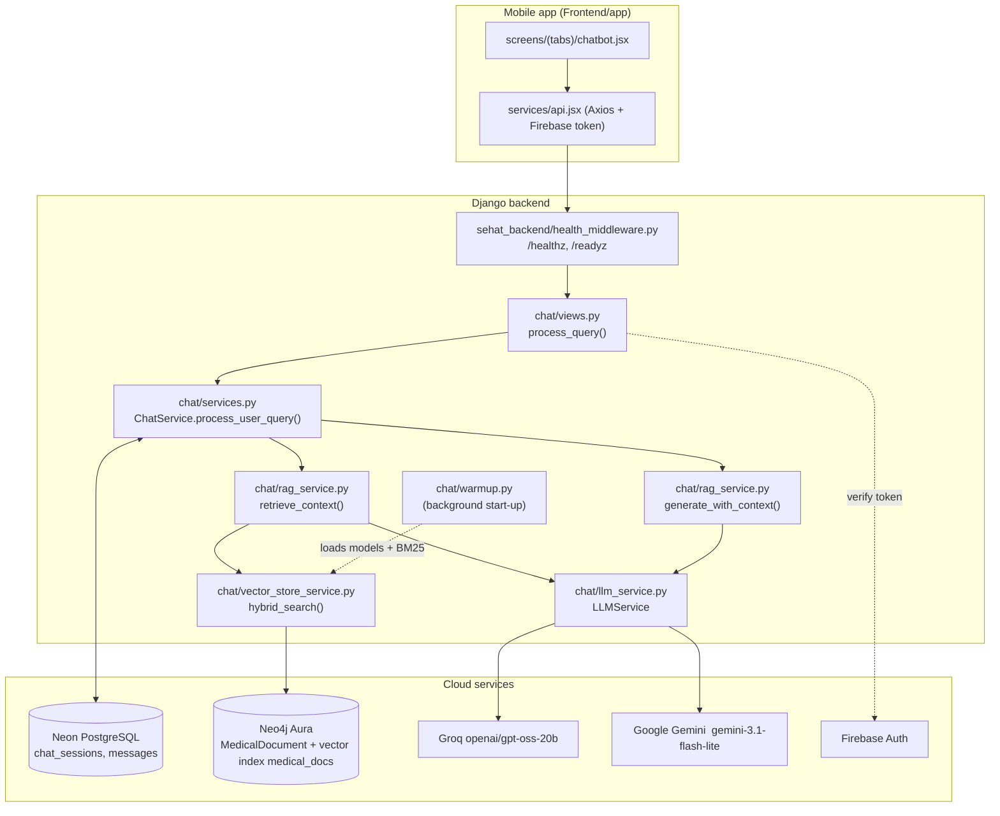

# SEHAT — Architecture & Request Flow

This document explains **exactly what happens in the code**, step by step, with real file and function names. Setup instructions are in [README.md](README.md).

All backend paths are relative to `Backend/sehat_backend/`.

---

## 1. Big picture

---

## 2. Server start-up (`chat/apps.py` → `chat/warmup.py`)

1. `ChatConfig.ready()` initialises Firebase Admin and calls `start_warmup()` (skipped for `migrate`, `test`, `shell`, … and in the runserver auto-reloader parent).
2. `_run_warmup()` runs in a background thread:
   - resolves the Neo4j database name,
   - loads `all-MiniLM-L6-v2` (`VectorStoreService.load_models`) — ~36 s,
   - rebuilds the in-memory BM25 index from all Neo4j chunks (`warm_up_bm25_from_neo4j`) — ~12 s,
   - attaches the Neo4j vector index `medical_docs`.
3. State goes `idle → loading → ready` (or `failed`). Until `ready`, `/readyz` and `/api/chat/query/` return **503** (`warming_up`, header `Retry-After: 15`); the app shows "SEHAT AI is warming up. Please retry in a few seconds."

---

## 3. One chat message, step by step

### Step 1 — App (`Frontend/app/screens/(tabs)/chatbot.jsx`, `services/api.jsx`)
- User types a message; `apiService.sendMessage()` posts to `POST /api/chat/query/` with `session_id`, `query`, `firebase_uid`, `chat_history`.
- An Axios interceptor attaches `Authorization: Bearer <Firebase ID token>`.
- Base URL comes from `getBaseUrl()` in `api.jsx`.

### Step 2 — View (`chat/views.py` → `process_query`)
1. `extract_and_verify_token()` verifies the Firebase ID token (Firebase Admin, `AuthenticationService.verify_firebase_token` in `chat/services.py`) → **401** if missing/invalid.
2. `session_id` and `query` required → **400** otherwise.
3. Warm-up gate → **503** until the knowledge base is ready.
4. `check_rate_limit()` — max 10 requests / 60 s per user → **429**.
5. Query length ≤ 500 chars.
6. `get_user_session_or_404()` — the session must belong to this user.
7. Calls `ChatService.process_user_query()`.

### Step 3 — Chat service (`chat/services.py` → `ChatService.process_user_query`)
1. Loads the session's messages **from the database** (the backend is the source of truth; client `chat_history` is ignored) and groups them into turns (`extract_turn_pairs`).
2. `trigger_rolling_summarization_if_needed()` — when more than 8 turns exist, older turns are summarised once into `session.rolling_summary`.
3. Saves the user `Message`.
4. Calls `RAGService.retrieve_context()` with the last 8 turns, `clarification_round`, `rolling_summary`, `patient_context`.
5. **Subject tracking**: if the classifier reports a new patient (`subject_reference`, e.g. "my uncle"), `patient_context` is reset. On an **emergency** turn only `active_subject` is updated (facts are kept).
6. Merges new patient facts into `session.patient_context` (`merge_patient_facts`).
7. Calls `RAGService.generate_with_context()`.
8. Updates `clarification_round` (incremented on a follow-up question, reset on an answer / emergency).
9. Saves the bot `Message` (text + metadata: triage, sources, language, timings) in a single INSERT and logs one `[TIMING SUMMARY]` line.

### Step 4 — Understanding the message (`chat/rag_service.py` → `retrieve_context`)
1. `sanitize_input()` blocks prompt-injection patterns.
2. **In parallel** (thread pool `_EXECUTOR`):
   - `validate_query()` — regex greeting check; short queries (≤ 7 words) pass as valid; longer ones get an LLM check (VALID / UNCLEAR / INVALID / GREETING).
   - `detect_language()` — `english` / `roman_urdu` (Devanagari → `invalid_hindi`).
   - `classify_and_rewrite_query()` — the **intake classifier** (skipped for plain greetings).
3. **Emergency first**: if the classifier returns `triage_level == "Emergency"`, it overrides an "unclear/invalid" validation result (except prompt-injection inputs) and the turn returns immediately with status `emergency` — no search, no generation.
4. Greeting / invalid / unclear / Hindi → early return with that status.
5. Otherwise the classifier's `intent` routes the turn:

| `intent` | Result status | What happens next |
|---|---|---|
| `meta_query` ("what did I tell you?") | `meta_history` | Answer from conversation history |
| `translation_request` | `translation_request` | Re-render last bot reply in the requested language |
| `new_symptom_info` / `followup_answer` with missing details (and < 5 rounds) | `clarifying` | Ask **one** follow-up question |
| `capabilities_query` | `capabilities` | Explain what SEHAT can do |
| `small_talk` | `small_talk` | Short friendly reply, invite a health question |
| `off_topic` | `off_topic` | "I can only help with health questions." |
| `sufficient_for_answer` (or 5 rounds reached) | `valid` | Search + answer (below) |

6. For `valid`: the English search query comes from the classifier's `english_query` (fallback: `translate_to_english`), then `VectorStoreService.hybrid_search()`.

#### The intake classifier (`llm_service.py` → `classify_and_rewrite_query`)
One JSON call that returns: `intent`, `rewritten_query` (pronouns resolved from history), `english_query`, `new_facts`, `missing_for_diagnosis`, `follow_up_question`, `target_language`, `subject_reference`, **`triage_level`** and **`emergency_advice`**.
- Triage is judged from meaning (any spelling / language), using current message + history. No keyword lists.
- On a classifier failure, `classify_triage()` is called once as backup; if that also fails the level is `Doctor` (never `Self-Care` by default).

### Step 5 — Hybrid search (`chat/vector_store_service.py` → `hybrid_search`)
1. **Neo4j vector search** (top 10) runs in a background thread **while** **BM25** (top 10) runs locally.
2. **Reciprocal Rank Fusion**: `score = 0.4/(rank_bm25+60) + 0.6/(rank_neo4j+60)`.
3. **SBERT rerank**: all candidates encoded in one batch; cosine similarity to the query.
4. If the best score is **< 0.48** → no results ("no relevant content"). Otherwise keep chunks ≥ 0.35, max 5.

### Step 6 — Writing the answer (`chat/rag_service.py` → `generate_with_context`)
Branches by status: clarifying, meta_history, translation, off_topic, small_talk, **emergency**, greeting, capabilities, invalid, unclear, Hindi, then the main pipeline:

1. No chunks → triage-aware fallback: `Self-Care` → "not found in documents"; otherwise → "Please see a doctor soon."
2. **In parallel**: `verify_relevance()` (does the text answer the question?) and `generate_answer()` (Gemini). If relevance says NO, the generated answer is discarded and the fallback above is used.
3. `generate_answer()` prompt rules: answer only from the retrieved text, strict language (English or Roman Urdu), 4–6 points, highlight red flags, **no follow-up questions in the final answer**, always end with the disclaimer. Roman Urdu answers get a purity check (Arabic script / English leakage → one re-write).
4. RAGAS metrics run in a background thread (0.5 s wait); faithfulness < 0.25 would replace the answer with the no-info message.
5. Citations are built by `_build_citations()` (curated display title + page numbers) and appended as `--- Sources ---`.
6. `triage_level` comes from the intake classifier (`classify_triage` only if missing).

**Emergency reply** = "call **1122**" header in the user's language + the classifier's situation-specific `emergency_advice` (generic first-aid text if empty).

---

## 4. LLM providers (`chat/llm_service.py`)

| Call type | Chain | Notes |
|---|---|---|
| Aux calls (`_call_aux_llm`): classifier, validate, language, relevance, triage backup, greeting, translation | **Groq** `openai/gpt-oss-20b` → **Gemini** `gemini-3.1-flash-lite` → **OpenAI** `gpt-4o` | Order set by `AUX_LLM_PROVIDER_ORDER` (`groq_first` default) |
| Answer generation (`_call_generation_llm`) | **Gemini** → Groq | |

Safety / speed behaviour:
- Groq `max_retries=0`; on a **429** Groq is skipped until its `retry-after` passes (circuit breaker `_groq_blocked_until`).
- A Groq reply cut off at `max_tokens` (`finish_reason == "length"`, gpt-oss spends tokens on reasoning) is treated as a failure → next provider.
- OpenAI `insufficient_quota` → OpenAI skipped for 1 hour (`_openai_blocked_until`).
- Clients are created once and reused (`_aux_clients`).

Free-tier limits (current keys): Groq 8,000 tokens/min and 200,000 tokens/day; Gemini requests/min limit; OpenAI key has no credits.

---

## 5. Triage

| Level | Meaning (used in both classifier and `classify_triage`) | App badge (`chatbot.jsx`) |
|---|---|---|
| `Emergency` | Possible threat to life, limb or safety of anyone, incl. self-harm | Red "Emergency" |
| `Doctor` | Needs in-person exam, tests or prescription | Orange "Consult Doctor" |
| `Self-Care` | Mild, safe to manage at home | Green "Self-Care" |
| `null` | No clinical content (greeting, small talk, off-topic, meta, translation) | No badge |

If unsure, the more urgent level is chosen.

---

## 6. Data model (`chat/models.py`)

- **`ChatSession`** (`chat_sessions`): `id` (UUID), `firebase_uid`, `title`, `session_metadata` (JSON: `clarification_round`, `active_subject`), `rolling_summary`, `patient_context` (JSON facts), `summarized_up_to_turn`, timestamps.
- **`Message`** (`messages`): `id`, `session`, `sender` (`user`/`bot`), `message_text`, `metadata` (JSON: `triage_level`, `sources`, `answer_body`, `disclaimer`, `language`, `model`, `ragas_metrics`, `stage_timings`), `timestamp`, `sequence_number`.

Database: Neon PostgreSQL with `conn_max_age=600` and `conn_health_checks=True` (Neon drops idle connections).

---

## 7. Knowledge base

- **15 PDFs** in `Backend/medical_documents/` covering 10 diseases: Dengue, Diarrhoea, Hepatitis A, Influenza, Tuberculosis, Malaria, Skin allergy / contact dermatitis, Typhoid, Common cold, UTI.
- Ingestion: `python manage.py ingest_documents` → `DocumentService` (PyPDFLoader, cleaning, 500-char chunks / 100 overlap, disease tag) → `VectorStoreService.add_chunks_to_store` (Neo4j `MedicalDocument` nodes with `text`, `embedding`, `source_file`, `page`, `disease`, `source_hash`).
- Unchanged PDFs are skipped by SHA-256 hash (`FORCE_REINGEST=true` to force).
- ~9,360 chunks currently indexed.

---

## 8. Measured latency (typical, free tiers)

| Turn type | Before optimisation | Now (normal pace) |
|---|---|---|
| Full answer (doctor / self-care / follow-up) | 35–81 s | 8–19 s |
| Emergency | 42 s | 4–8 s |
| Greeting | 57 s | 3–4 s |

Biggest remaining costs: Gemini answer generation (3–6 s), classifier (1–4 s), Neon DB round-trips (~2.5 s per turn, ~250 ms each from Pakistan to US-East), Neo4j vector search (~1 s).

---

## 9. Known limitations & next steps

1. **Free-tier LLM quotas** cap throughput (~2–3 full turns/min); heavy use falls back to slower providers.
2. **Warm-up 503**: the first ~50 s after a restart return `warming_up`; the app does not auto-retry yet.
3. **No streaming**: the app waits for the full JSON. Streaming would need frontend changes and must respect the post-generation checks (language purity, disclaimer, citations).
4. **Admin document endpoints are not authenticated** (`admin_list_documents`, `admin_add_document`, `admin_remove_document`).
5. **Validation gate**: for messages > 7 words, `validate_query` may still return "unclear" for vague non-emergency messages (emergencies are protected by the classifier override).
6. Frontend `getBaseUrl()` is currently a fixed LAN IP; change it per network.
7. Neo4j is used as a **vector store** only (no graph relationships).

---

## 10. Glossary
- **RAG** — search trusted documents first, then let the LLM answer only from them.
- **BM25** — keyword search. **Vector search** — meaning-based search using embeddings.
- **RRF** — merges two ranked lists into one.
- **Triage** — how urgently the patient should get care.
- **Roman Urdu** — Urdu written in English letters ("Mujhe bukhar hai").
